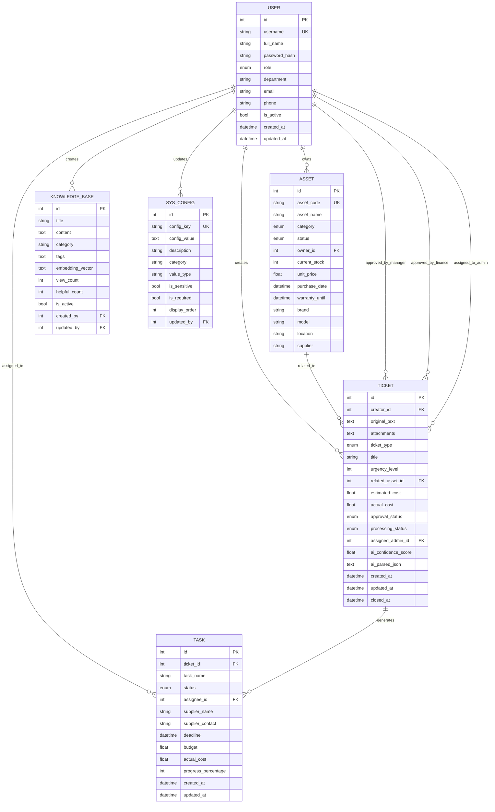

# 数据库设计总结

## 已完成的工作

### 1. 数据库模型设计 ✅

已创建6个核心数据表的SQLModel模型：

#### 文件结构
```
backend/app/models/
├── __init__.py           # 模型导出
├── enums.py              # 枚举类型定义
├── user.py               # 用户表
├── asset.py              # 资产表
├── ticket.py             # 工单表
├── task.py               # 任务表
├── knowledge_base.py     # 知识库表
└── sys_config.py         # 系统配置表
```

#### 核心表说明

**1. User (用户表)**
- 支持4种角色：员工、行政、主管、系统管理员
- 包含基本信息、部门、联系方式
- 关联：工单、任务、资产

**2. Asset (资产表)**
- 资产分类：IT设备、办公家具、耗材
- 资产状态：闲置、使用中、维修中、报废
- 支持库存管理、财务信息、供应商信息

**3. Ticket (工单表)**
- 工单类型：采购、报修、申领、咨询
- 审批流程：无需审批→主管审批→财务审批→已通过
- 处理状态：待接单→处理中→已闭环
- 支持多模态输入（文本、图片）
- AI解析字段：置信度、结构化JSON

**4. Task (任务表)**
- 关联工单，由行政人员执行
- 支持供应商对接、进度跟踪
- 费用管理：预算、实际花费

**5. KnowledgeBase (知识库表)**
- 存储企业SOP、常见问题
- 支持向量化检索（可选）
- 统计字段：查看次数、有帮助次数

**6. SysConfig (系统配置表)**
- 动态配置大模型API（Base URL、API Key、Model Name）
- 支持敏感信息标记
- 分类管理：llm、approval、system等

### 2. 数据库关系设计 ✅

```
User (1) ─────< (N) Ticket
User (1) ─────< (N) Task
User (1) ─────< (N) Asset

Asset (1) ────< (N) Ticket

Ticket (1) ───< (N) Task
```

### 3. 索引优化 ✅

已设计关键索引：
- 用户表：username（唯一）、department+role（复合）
- 资产表：asset_code（唯一）、category+status（复合）
- 工单表：creator_id+created_at、processing_status+approval_status
- 任务表：assignee_id+status、deadline（部分索引）
- 知识库表：category、全文搜索索引

### 4. 数据库初始化脚本 ✅

**文件：** `database/init_db.py`

功能：
- 创建所有表结构
- 插入默认系统配置（LLM配置、审批规则等）
- 创建默认用户（admin、admin_staff、manager、employee）
- 插入示例知识库数据（WiFi、报销、会议室等）
- 插入示例资产数据

使用方法：
```bash
python database/init_db.py
```

### 5. 数据库迁移方案 ✅

**文件：** `database/MIGRATION_GUIDE.md`

已提供完整的Alembic迁移方案：
- 初始化配置
- 迁移脚本模板
- 常用命令
- 最佳实践
- 零停机迁移策略

### 6. 技术文档 ✅

**文件：** `database/DATABASE_DESIGN.md`

包含：
- 完整的表结构说明
- 字段类型和约束
- 关系图
- 性能优化建议
- 安全考虑
- 备份策略

## 技术选型

- **数据库：** PostgreSQL 14+
- **ORM：** SQLModel (SQLAlchemy 2.0 + Pydantic)
- **迁移工具：** Alembic
- **向量检索：** Chroma/FAISS（可选，用于知识库）

## 关键特性

### 1. 类型安全
- 使用SQLModel结合Pydantic，提供完整的类型提示
- 自动数据验证
- IDE友好

### 2. 枚举类型
- 所有状态字段使用Enum，避免魔法字符串
- 类型安全的状态转换

### 3. 时间戳自动管理
- created_at：创建时自动设置
- updated_at：更新时自动更新（通过数据库触发器）

### 4. 软删除支持
- User表的is_active字段
- KnowledgeBase表的is_active字段

### 5. 审计追踪
- 工单的审批人记录
- 配置的更新人记录
- 知识库的创建人和更新人

### 6. 性能优化
- 合理的索引设计
- 部分索引（WHERE条件索引）
- 连接池配置
- 查询优化建议

## 数据库ER图



## 下一步工作建议

1. **后端开发**
   - 实现数据库连接和会话管理
   - 创建CRUD操作的Service层
   - 实现数据验证和业务逻辑

2. **API开发**
   - 设计RESTful API接口
   - 实现JWT认证
   - 添加RBAC权限控制

3. **AI集成**
   - 实现OpenAI协议的LLM调用
   - 工单智能解析
   - 知识库向量化检索

4. **测试**
   - 单元测试（模型验证）
   - 集成测试（数据库操作）
   - 性能测试（查询优化）

## 文件清单

```
/mnt/e/agent/AdminAgent/
├── backend/app/models/
│   ├── __init__.py
│   ├── enums.py
│   ├── user.py
│   ├── asset.py
│   ├── ticket.py
│   ├── task.py
│   ├── knowledge_base.py
│   └── sys_config.py
├── database/
│   ├── DATABASE_DESIGN.md      # 数据库设计文档
│   ├── MIGRATION_GUIDE.md      # 迁移指南
│   └── init_db.py              # 初始化脚本
└── 行政智能体网页端开发提示词.md
```

## 总结

数据库模型设计已完成，包括：
- ✅ 6个核心表的SQLModel定义
- ✅ 完整的关系设计
- ✅ 索引优化方案
- ✅ 初始化脚本
- ✅ 迁移方案
- ✅ 技术文档

所有设计遵循以下原则：
1. **类型安全**：使用SQLModel和Pydantic
2. **可扩展性**：支持向量检索、多模态输入
3. **性能优化**：合理的索引和查询优化
4. **安全性**：密码哈希、敏感信息标记
5. **可维护性**：清晰的文档和迁移方案

数据库设计已就绪，可以开始后端API开发。
