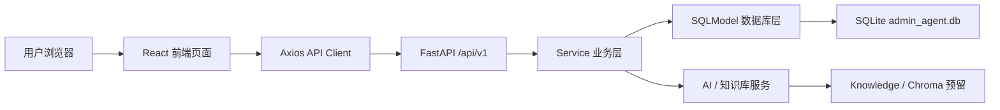
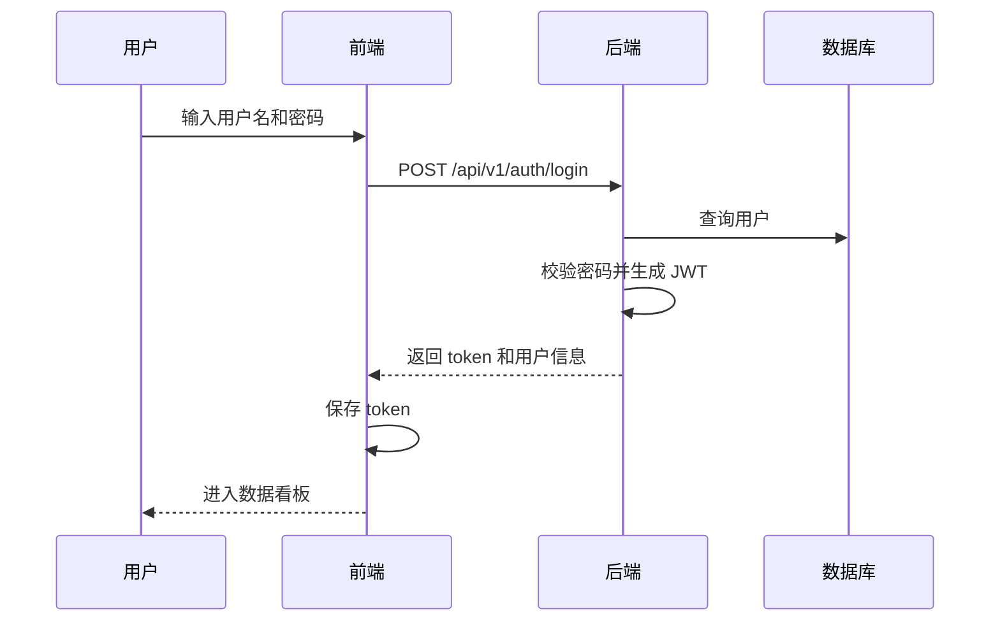
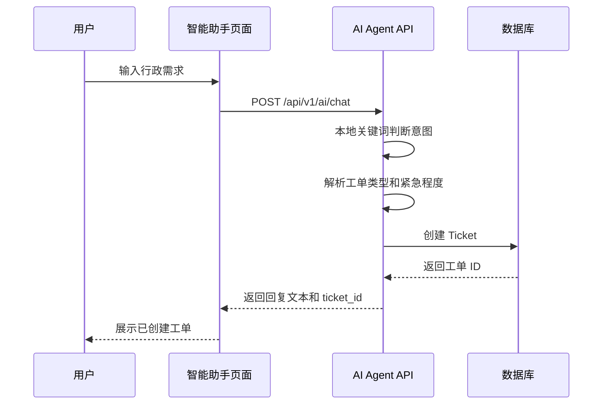
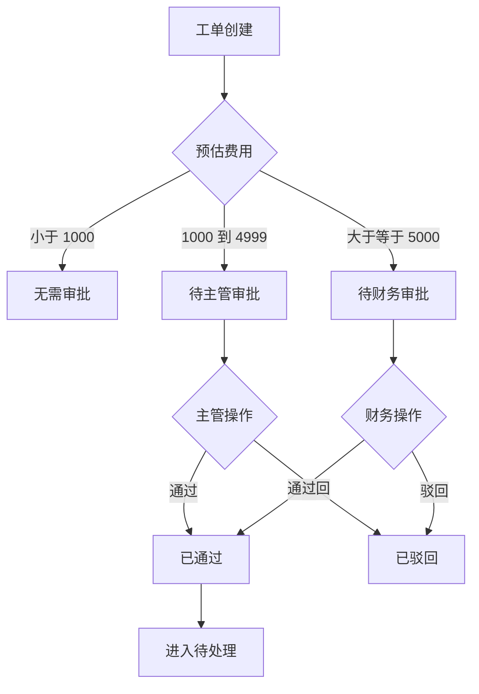
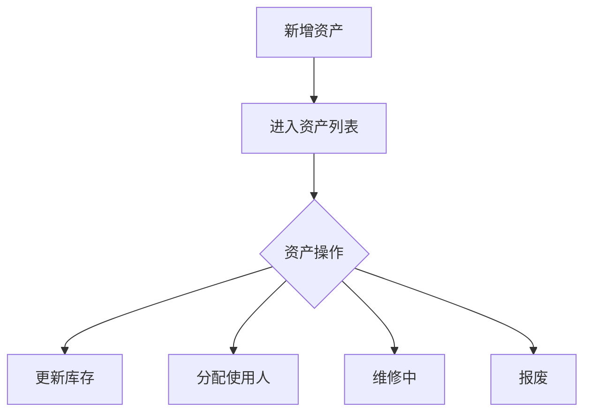

# Admin Agent 项目完整文档

## 1. 项目定位

Admin Agent 是一个企业内部行政智能体系统，用于承接员工行政咨询、行政工单提交、审批流转、资产管理、任务执行和系统配置维护。系统目标是把分散的行政需求统一到一个网页端平台中，让员工可以自然语言提交问题或需求，让行政人员可以在后台完成处理闭环。

当前项目已经具备本地一体化运行能力：FastAPI 后端提供接口，同时托管前端构建后的静态页面。推荐本地入口为：

```text
http://localhost:8030/
```

默认账号：

```text
admin / admin123
```

## 2. 当前运行方式

### 2.1 一体化运行

```powershell
cd E:\agent\AdminAgent\backend
python -m uvicorn app.main:app --host 127.0.0.1 --port 8030
```

访问地址：

- Web 页面：`http://localhost:8030/`
- 健康检查：`http://localhost:8030/health`
- API 文档：`http://localhost:8030/docs`
- OpenAPI：`http://localhost:8030/openapi.json`

### 2.2 前端开发模式

```powershell
cd E:\agent\AdminAgent\frontend
npm install --legacy-peer-deps
npm run dev
```

前端开发服务默认使用 `3000` 端口，`/api` 请求会代理到 `http://localhost:8030`。

### 2.3 前端生产构建

```powershell
cd E:\agent\AdminAgent\frontend
npm run build
```

构建目录：

```text
frontend/dist
```

后端启动时会检查 `frontend/dist` 是否存在。如果存在：

- `/` 返回 `frontend/dist/index.html`
- `/assets/*` 返回前端静态资源
- 前端路由刷新时由后端回退到 `index.html`

## 3. 技术架构

### 3.1 后端

后端位于 `backend/app`，核心技术：

- FastAPI：HTTP API 和应用入口
- SQLModel：数据模型和 ORM
- Pydantic：请求与响应校验
- Uvicorn：ASGI 服务
- JWT：登录 token
- SQLite：当前本地默认数据库
- Redis 兼容缓存层：当前可用内存实现，方便本地运行
- Chroma：知识库向量检索预留
- OpenAI SDK：AI 服务接入预留

后端入口：

```text
backend/app/main.py
```

### 3.2 前端

前端位于 `frontend/src`，核心技术：

- React
- TypeScript
- Vite
- Ant Design
- React Router
- TanStack Query
- Zustand
- Axios

前端入口：

```text
frontend/src/main.tsx
```

路由入口：

```text
frontend/src/router/index.tsx
```

接口封装：

```text
frontend/src/services/api.ts
frontend/src/services/auth.ts
```

### 3.3 数据流



## 4. 目录结构

```text
AdminAgent/
├─ backend/
│  ├─ app/
│  │  ├─ main.py
│  │  ├─ api/
│  │  │  ├─ deps.py
│  │  │  └─ v1/
│  │  │     ├─ __init__.py
│  │  │     ├─ auth.py
│  │  │     ├─ tickets.py
│  │  │     ├─ assets.py
│  │  │     ├─ tasks.py
│  │  │     ├─ approvals.py
│  │  │     ├─ ai_agent.py
│  │  │     ├─ knowledge.py
│  │  │     └─ configs.py
│  │  ├─ core/
│  │  │  ├─ config.py
│  │  │  ├─ database.py
│  │  │  ├─ security.py
│  │  │  ├─ redis.py
│  │  │  └─ chroma.py
│  │  ├─ models/
│  │  ├─ schemas/
│  │  ├─ services/
│  │  └─ repositories/
│  ├─ tests/
│  ├─ requirements.txt
│  └─ Dockerfile
├─ frontend/
│  ├─ src/
│  │  ├─ pages/
│  │  ├─ layouts/
│  │  ├─ components/
│  │  ├─ router/
│  │  ├─ services/
│  │  ├─ stores/
│  │  ├─ types/
│  │  └─ utils/
│  ├─ public/
│  ├─ dist/
│  ├─ package.json
│  └─ vite.config.ts
├─ database/
├─ monitoring/
├─ docker-compose.yml
├─ README.md
└─ 项目完整文档.md
```

## 5. 后端模块说明

### 5.1 应用入口

文件：

```text
backend/app/main.py
```

职责：

- 创建 FastAPI 应用
- 注册 CORS
- 注册 `/api/v1` 路由
- 初始化数据库表
- 初始化 Chroma 服务
- 提供健康检查接口
- 托管前端 `frontend/dist`
- 支持前端 SPA 路由回退

主要公共接口：

- `GET /`
- `GET /health`
- `GET /health/ready`
- `GET /health/live`
- `GET /metrics`

### 5.2 配置模块

文件：

```text
backend/app/core/config.py
```

当前关键配置：

- `PORT=8030`
- `DATABASE_URL=sqlite:///./admin_agent.db`
- `ACCESS_TOKEN_EXPIRE_MINUTES=10080`
- `OPENAI_BASE_URL=https://api.openai.com/v1`
- `OPENAI_MODEL=gpt-4`

### 5.3 数据库模块

文件：

```text
backend/app/core/database.py
```

职责：

- 创建数据库 engine
- 兼容 SQLite 本地运行
- 提供 `get_session`
- 提供 `get_db`
- 提供建表初始化能力

### 5.4 安全模块

文件：

```text
backend/app/core/security.py
```

职责：

- 密码哈希
- 密码校验
- JWT token 创建
- JWT token 解析

### 5.5 认证依赖

文件：

```text
backend/app/api/deps.py
```

职责：

- 读取请求头中的 Bearer Token
- 解析当前用户
- 校验用户是否启用
- 提供管理员权限校验函数

## 6. 数据模型

### 6.1 User

文件：

```text
backend/app/models/user.py
```

字段：

- `id`
- `username`
- `full_name`
- `password_hash`
- `role`
- `department`
- `email`
- `phone`
- `is_active`
- `created_at`
- `updated_at`

角色：

- `employee`
- `admin_staff`
- `manager`
- `sys_admin`

### 6.2 Ticket

文件：

```text
backend/app/models/ticket.py
```

字段：

- `id`
- `requester_id`
- `original_text`
- `attachments`
- `ticket_type`
- `related_asset_id`
- `estimated_cost`
- `approval_status`
- `processing_status`
- `assigned_to`
- `urgency`
- `created_at`
- `updated_at`
- `closed_at`

工单类型：

- `purchase`
- `repair`
- `requisition`
- `consultation`

审批状态：

- `no_approval`
- `pending_manager`
- `pending_finance`
- `approved`
- `rejected`

处理状态：

- `pending`
- `in_progress`
- `completed`
- `closed`

紧急程度：

- `low`
- `normal`
- `high`
- `urgent`

### 6.3 Asset

文件：

```text
backend/app/models/asset.py
```

字段：

- `id`
- `asset_code`
- `name`
- `category`
- `status`
- `owner_id`
- `current_stock`
- `unit_price`
- `purchase_date`
- `warranty_expire`
- `location`
- `description`
- `created_at`
- `updated_at`

分类：

- `it_equipment`
- `office_furniture`
- `consumables`
- `other`

状态：

- `idle`
- `in_use`
- `maintenance`
- `scrapped`

### 6.4 Task

文件：

```text
backend/app/models/task.py
```

字段：

- `id`
- `title`
- `description`
- `related_ticket_id`
- `assigned_to`
- `status`
- `priority`
- `due_date`
- `created_at`
- `updated_at`
- `completed_at`

状态：

- `todo`
- `in_progress`
- `completed`
- `cancelled`

### 6.5 KnowledgeBase

文件：

```text
backend/app/models/knowledge.py
```

字段：

- `id`
- `title`
- `content`
- `category`
- `embedding`
- `view_count`
- `is_active`
- `created_by`
- `created_at`
- `updated_at`

### 6.6 SysConfig

文件：

```text
backend/app/models/config.py
```

字段：

- `id`
- `config_key`
- `config_value`
- `description`
- `is_sensitive`
- `updated_by`
- `updated_at`

配置 key 示例：

- `LLM_BASE_URL`
- `LLM_API_KEY`
- `LLM_MODEL`
- `LLM_TEMPERATURE`
- `LLM_MAX_TOKENS`
- `EMBEDDING_MODEL`
- `EMBEDDING_BASE_URL`
- `VECTOR_DB_PATH`
- `APPROVAL_THRESHOLD`
- `AUTO_ASSIGN_ADMIN`
- `SYSTEM_NAME`
- `SESSION_TIMEOUT`
- `MAX_UPLOAD_SIZE`

### 6.7 ApprovalRecord

文件：

```text
backend/app/models/approval.py
```

字段：

- `id`
- `ticket_id`
- `approver_id`
- `approval_type`
- `status`
- `comment`
- `created_at`

## 7. API 路由清单

统一前缀：

```text
/api/v1
```

### 7.1 Auth

文件：

```text
backend/app/api/v1/auth.py
```

接口：

- `POST /api/v1/auth/login`
- `POST /api/v1/auth/register`
- `GET /api/v1/auth/me`
- `POST /api/v1/auth/logout`

说明：

- 首次登录时会确保默认管理员存在。
- 默认管理员为 `admin / admin123`。
- 登录成功返回 `token` 和 `user`。

### 7.2 Tickets

文件：

```text
backend/app/api/v1/tickets.py
```

接口：

- `POST /api/v1/tickets/`
- `GET /api/v1/tickets/`
- `GET /api/v1/tickets/{ticket_id}`
- `PATCH /api/v1/tickets/{ticket_id}`
- `DELETE /api/v1/tickets/{ticket_id}`

查询参数：

- `skip`
- `limit`
- `processing_status`

### 7.3 Assets

文件：

```text
backend/app/api/v1/assets.py
```

接口：

- `POST /api/v1/assets/`
- `GET /api/v1/assets/`
- `GET /api/v1/assets/{asset_id}`
- `PATCH /api/v1/assets/{asset_id}`
- `DELETE /api/v1/assets/{asset_id}`
- `POST /api/v1/assets/{asset_id}/stock`

查询参数：

- `skip`
- `limit`
- `category`
- `status`

### 7.4 Tasks

文件：

```text
backend/app/api/v1/tasks.py
```

接口：

- `POST /api/v1/tasks/`
- `GET /api/v1/tasks/`
- `GET /api/v1/tasks/{task_id}`
- `PATCH /api/v1/tasks/{task_id}`
- `DELETE /api/v1/tasks/{task_id}`

查询参数：

- `skip`
- `limit`
- `related_ticket_id`
- `assigned_to`
- `status`

### 7.5 Approvals

文件：

```text
backend/app/api/v1/approvals.py
```

接口：

- `GET /api/v1/approvals/pending`
- `POST /api/v1/approvals/tickets/{ticket_id}/approve`
- `POST /api/v1/approvals/tickets/{ticket_id}/reject`

查询参数：

- `approval_type=manager`
- `approval_type=finance`

### 7.6 AI Agent

文件：

```text
backend/app/api/v1/ai_agent.py
```

接口：

- `POST /api/v1/ai/chat`
- `POST /api/v1/ai/knowledge/sync`
- `GET /api/v1/ai/knowledge/search`

聊天请求示例：

```json
{
  "message": "会议室投影坏了，帮我报修",
  "image_urls": []
}
```

聊天响应示例：

```json
{
  "intent_type": "ticket_generation",
  "response": "已为你创建工单 #1，行政人员会跟进处理。",
  "ticket_id": 1,
  "confidence": 0.75
}
```

### 7.7 Knowledge

文件：

```text
backend/app/api/v1/knowledge.py
```

接口：

- `POST /api/v1/knowledge/`
- `GET /api/v1/knowledge/`
- `GET /api/v1/knowledge/{knowledge_id}`
- `PUT /api/v1/knowledge/{knowledge_id}`
- `DELETE /api/v1/knowledge/{knowledge_id}`
- `POST /api/v1/knowledge/search`

### 7.8 Configs

文件：

```text
backend/app/api/v1/configs.py
```

接口：

- `POST /api/v1/configs/`
- `GET /api/v1/configs/`
- `GET /api/v1/configs/{config_key}`
- `PUT /api/v1/configs/{config_key}`
- `DELETE /api/v1/configs/{config_key}`
- `POST /api/v1/configs/init`

## 8. 前端页面说明

### 8.1 登录页

文件：

```text
frontend/src/pages/Login.tsx
```

功能：

- 用户名密码登录
- 默认填充 `admin / admin123`
- 登录成功后保存 token 和用户信息
- 跳转到 `/dashboard`

### 8.2 主布局

文件：

```text
frontend/src/layouts/MainLayout.tsx
```

功能：

- 左侧导航
- 顶部用户信息
- 退出登录
- 页面内容出口

导航项：

- 数据看板 `/dashboard`
- 智能助手 `/chat`
- 工单管理 `/tickets`
- 任务看板 `/tasks`
- 审批中心 `/approvals`
- 资产管理 `/assets`
- 系统设置 `/settings`

### 8.3 数据看板

文件：

```text
frontend/src/pages/Dashboard.tsx
```

调用接口：

- `GET /tickets/`
- `GET /assets/`
- `GET /tasks/`

展示：

- 工单总数
- 待处理工单
- 待办任务
- 待审批数量
- 最新工单
- 资产概况

### 8.4 智能助手

文件：

```text
frontend/src/pages/ChatInterface.tsx
```

调用接口：

- `POST /ai/chat`

交互：

- 用户输入自然语言需求
- 页面追加用户消息
- 后端判断意图
- 如果是行政需求，自动创建工单
- 如果返回 `ticket_id`，刷新工单列表缓存

### 8.5 工单管理

文件：

```text
frontend/src/pages/TicketList.tsx
```

调用接口：

- `GET /tickets/`
- `POST /tickets/`

功能：

- 工单列表
- 新建工单弹窗
- 展示工单类型、紧急度、费用、审批状态、处理状态

### 8.6 审批中心

文件：

```text
frontend/src/pages/ApprovalCenter.tsx
```

调用接口：

- `GET /approvals/pending?approval_type=manager`
- `GET /approvals/pending?approval_type=finance`
- `POST /approvals/tickets/{id}/approve?approval_type=manager|finance`
- `POST /approvals/tickets/{id}/reject`

功能：

- 合并展示主管和财务待审批工单
- 支持通过
- 支持驳回
- 操作后刷新审批和工单数据

### 8.7 任务看板

文件：

```text
frontend/src/pages/TaskBoard.tsx
```

调用接口：

- `GET /tasks/`
- `POST /tasks/`

功能：

- 任务列表
- 新建任务
- 设置关联工单、负责人、优先级和状态

### 8.8 资产管理

文件：

```text
frontend/src/pages/AssetManagement.tsx
```

调用接口：

- `GET /assets/`
- `POST /assets/`

功能：

- 资产列表
- 新增资产
- 展示资产编号、名称、分类、状态、库存和位置

### 8.9 系统设置

文件：

```text
frontend/src/pages/SystemSettings.tsx
```

调用接口：

- `GET /configs/`
- `POST /configs/`

功能：

- 按业务分类维护基础设置、AI 模型、审批规则和知识库设置
- 直接填写系统名称、模型地址、模型密钥、审批金额等字段
- 支持补齐默认设置
- 支持保存全部设置
- 敏感字段使用密码输入框展示

## 9. 核心业务流程

### 9.1 登录流程



### 9.2 智能助手创建工单



### 9.3 审批流程



### 9.4 行政处理流程


### 9.5 资产管理流程



## 10. 前后端接口对应关系

| 页面 | 前端文件 | 后端接口 |
|---|---|---|
| 登录 | `Login.tsx` | `/api/v1/auth/login` |
| 数据看板 | `Dashboard.tsx` | `/tickets/`, `/assets/`, `/tasks/` |
| 智能助手 | `ChatInterface.tsx` | `/ai/chat` |
| 工单管理 | `TicketList.tsx` | `/tickets/` |
| 审批中心 | `ApprovalCenter.tsx` | `/approvals/pending`, `/approvals/tickets/{id}/approve`, `/reject` |
| 任务看板 | `TaskBoard.tsx` | `/tasks/` |
| 资产管理 | `AssetManagement.tsx` | `/assets/` |
| 系统设置 | `SystemSettings.tsx` | `/configs/` |

前端 `apiClient` 的 baseURL 为：

```text
/api/v1
```

因此页面中写 `/tickets/`，实际请求为：

```text
/api/v1/tickets/
```

## 11. 环境变量

后端读取 `backend/app/.env` 或环境变量。

常用配置：

```env
APP_NAME=Admin Agent API
APP_VERSION=1.0.0
DEBUG=true
HOST=0.0.0.0
PORT=8030
DATABASE_URL=sqlite:///./admin_agent.db
SECRET_KEY=your-secret-key-change-in-production
ALGORITHM=HS256
ACCESS_TOKEN_EXPIRE_MINUTES=10080
REDIS_HOST=localhost
REDIS_PORT=6379
REDIS_DB=0
OPENAI_BASE_URL=https://api.openai.com/v1
OPENAI_MODEL=gpt-4
```

## 12. 数据库说明

当前本地默认数据库：

```text
backend/admin_agent.db
```

也可能根据启动目录生成：

```text
admin_agent.db
```

启动时后端会自动建表。适合本地开发和演示。

Docker Compose 中保留 PostgreSQL 服务配置，适合后续生产化部署。若切换 PostgreSQL，需要同步调整 `DATABASE_URL`。

## 13. 测试与验证

### 13.1 后端语法检查

```powershell
python -m compileall -q backend\app
```

### 13.2 后端测试

```powershell
python -m pytest backend\tests\unit\test_health.py -q
```

### 13.3 前端检查

```powershell
cd frontend
npm run lint
npm run build
```

### 13.4 手动 API 验证

健康检查：

```powershell
Invoke-RestMethod http://localhost:8030/health
```

登录：

```powershell
Invoke-RestMethod http://localhost:8030/api/v1/auth/login `
  -Method Post `
  -ContentType 'application/json' `
  -Body '{"username":"admin","password":"admin123"}'
```

## 14. 部署说明

### 14.1 本地一体化部署

推荐用于当前开发验证：

1. 构建前端。
2. 启动后端 `8030`。
3. 直接访问 `http://localhost:8030/`。

### 14.2 Docker Compose

项目根目录包含：

```text
docker-compose.yml
```

包含服务：

- PostgreSQL
- Redis
- Backend
- Frontend
- pgAdmin，可选 profile

启动示例：

```powershell
docker compose up -d
```

注意：当前本地调试更推荐 SQLite + 直接启动后端；Docker Compose 更适合作为部署模板继续完善。

## 15. 当前已实现功能

已实现并接入页面：

- 登录
- 受保护路由
- 退出登录
- 数据看板
- 智能助手
- 工单列表、新建、编辑、删除、详情查看、筛选搜索
- 审批中心列表、审批意见、通过和驳回
- 任务列表、新建、编辑、删除、快捷状态流转
- 资产列表、新建、编辑、删除、详情查看、库存调整
- 知识库列表、新建、编辑、删除、搜索测试、同步知识
- 系统配置列表和新建
- 后端健康检查
- 后端托管前端构建产物

已实现后端接口：

- Auth
- Tickets
- Assets
- Tasks
- Approvals
- AI Agent
- Knowledge
- Configs

## 16. 待完善事项

建议后续继续完善：

- 用户管理页面
- 工单操作历史
- 工单关闭时填写实际费用
- 资产领用、归还、报废的专门业务入口
- 审批记录持久化和审批历史页
- Dashboard 独立统计接口，避免前端自行聚合全部列表
- AI 服务真实模型调用和结构化解析
- 知识库向量检索的完整同步与检索体验
- 更严格的 RBAC 数据隔离
- 统一错误响应格式
- 生产环境敏感配置加密或脱敏
- 数据库迁移脚本
- 更完整的集成测试和端到端测试

## 17. 常见问题

### 17.1 打开 8030 空白

先确认是否已构建前端：

```powershell
cd frontend
npm run build
```

再重启后端：

```powershell
cd ..\backend
python -m uvicorn app.main:app --host 127.0.0.1 --port 8030
```

### 17.2 登录失败

确认使用：

```text
admin / admin123
```

如果数据库中已有同名账号且密码不是默认值，可以删除本地 SQLite 数据库后重新启动，或通过数据库工具修改用户。

### 17.3 接口 401

说明 token 缺失或失效。重新登录即可。

### 17.4 前端开发服务接口不通

确认后端正在 `8030` 端口运行，前端 `vite.config.ts` 已将 `/api` 代理到 `http://localhost:8030`。

## 18. 维护建议

- 根目录 `README.md` 保持快速启动和入口信息。
- 本文档维护当前项目实际情况，不写远期幻想功能。
- 新增接口时同步更新第 7 章 API 清单。
- 新增页面时同步更新第 8 章页面说明。
- 修改端口、默认账号、数据库类型时同步更新第 2、11、12 章。
- 每次大改后至少执行后端编译检查、健康检查、前端 lint 和前端 build。
